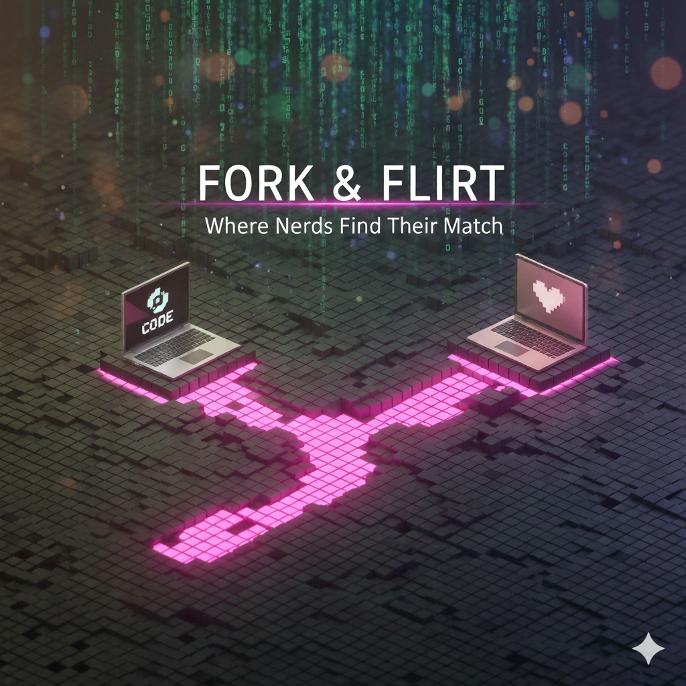

  
  
  <h1>ForkFlirt 💘</h1>
  
  
<strong>The Decentralized, Client-Agnostic Dating Protocol.</strong>

> "Commit to love. Push to master."

ForkFlirt is a serverless dating infrastructure built entirely on top of GitHub. It replaces the centralized "Black Box" algorithms of Tinder/Hinge with transparent, user-owned logic.

You do not "sign up" for ForkFlirt. You **fork** it.

---

## ⚡️ The 30-Second Pitch

1.  **You Own The Database:** Your profile is a JSON file in a repository you control.
2.  **You Run The Algorithm:** The matching logic runs in your browser, not on a server in Silicon Valley.
3.  **Encrypted Signals:** Messages are RSA-encrypted payloads transported via GitHub Issues.
4.  **Identity, Not Algorithms:** Verify real humans via DNS TXT records, Keybase proofs, or personal domains. No catfishing.

---

## 🚀 Quick Start (Create a Profile)

To join the network, you deploy your own instance of the client.

1.  **Fork this Repository** to your personal GitHub account.
2.  **Enable GitHub Pages:**
    - Go to `Settings` -> `Pages`.
    - Source: `GitHub Actions`.
    - _The included workflow will automatically build and deploy the client._
3.  **Visit your URL:** (e.g., `https://yourname.github.io/forkflirt`).
4.  **Run the Wizard:** The app will generate your cryptographic keys and commit your `profile.json` automatically.

---

## 📂 Monorepo Structure

This repository contains both the official client and the protocol standards.

| Directory                     | Description                                                                                                                |
| :---------------------------- | :------------------------------------------------------------------------------------------------------------------------- |
| **[`/client`](./client)**     | **The App.** A SvelteKit application (Adapter-Static) that acts as your interface to the network. This is what you deploy. |
| **[`/protocol`](./protocol)** | **The Standards.** JSON Schemas, Architecture Docs, and RFCs defining how clients communicate.                             |
| **[`/profile`](./profile)**   | **The Data.** This directory is empty by default. When you use the app, your images and `profile.json` are saved here.     |

---

## 🧠 Engineering & Protocol

ForkFlirt is a strictly defined protocol. If you are building a custom client (CLI, Mobile, Vim Plugin), start here:

- **[01 - Architecture](./protocol/docs/01-ARCHITECTURE.md):** How we use GitHub as a serverless relay.
- **[02 - Schema](./protocol/docs/02-SCHEMA.md):** The JSON standard (Bio, Vices, Survey Data).
- **[03 - Security](./protocol/docs/03-SECURITY.md):** The RSA-OAEP/AES-GCM Handshake spec.
- **[04 - The Algorithm](./protocol/docs/04-MATCHING.md):** How the Geometric Mean compatibility score is calculated.
- **[05 - Moderation](./protocol/docs/05-MODERATION.md):** The `.forkflirtignore` blocklist standard.
- **[06 - Verification](./protocol/docs/06-VERIFICATION.md):** Identity proofs via DNS TXT records and Keybase.

### Core Concepts

#### 1. Discovery

We rely on the GitHub Search API. Clients query `topic:forkflirt-profile` to populate the global feed.

#### 2. The "Handshake"

There is no backend. To message User B:

1.  Client A fetches User B's `public_key`.
2.  Client A encrypts the message.
3.  Client A posts a GitHub Issue on Repo B titled `ForkFlirt Handshake`.
4.  Client B (in browser) decrypts it locally.

#### 3. Verification (Trust Signals)

We rely on **Cross-Platform Identity**, not commit history. Since many Nerds (writers, gamers, scientists) do not push code, we verify you are a real human using:

- **DNS Verification:** Add a TXT record (`forkflirt-verify=username`) to a domain you own.
- **Keybase:** If you have a Keybase account, we automatically trust your proofs (Twitter, Reddit, Mastodon).

---

## Transparency & Safety

### 🕊️ Warrant Canary

As of **December 1, 2025**:
- Plug Puppy LLC has not received any warrants (government orders, subpoenas, NSLs, etc.)
- Plug Puppy LLC has not received any gag orders or non-disclosure requirements
- Plug Puppy LLC has not been compelled to modify the ForkFlirt codebase
- Plug Puppy LLC has not been required to hand over user data

This canary is automatically updated monthly. If this section is removed or not updated for 60 days, assume compromise.

**Last updated**: December 1, 2025
**Update method**: Automated GitHub Actions (`.github/workflows/warrant-canary.yml`)
**Immutable record**: `canary-2025-12-01` tag

### 🔒 Privacy & Security

ForkFlirt is built on public GitHub repositories, which provides decentralization and data ownership but comes with inherent tradeoffs:

#### What's Private
- ✅ Message content (end-to-end encrypted)
- ✅ Private keys (never leave your device)
- ✅ Passphrase (never stored, only used for key derivation)

#### What's Public
- ⚠️ Profile data (stored in public GitHub repo)
- ⚠️ Profile existence (discoverable via GitHub search)
- ⚠️ Interaction metadata (who creates Issues on whose repo)
- ⚠️ GitHub contribution graph

#### Privacy Best Practices
- Use a dedicated GitHub account for ForkFlirt
- Consider using approximate locations instead of exact city
- Keep profile information minimal and non-specific
- Use blocklists to control interactions
- Regularly review who can see your profile
- Enable the panic button in settings for emergency data deletion

For detailed security information, see [SECURITY.md](./SECURITY.md)

---

## 🤝 Contributing

We are an **Open Code** organization.

- **Client Improvements:** Submit PRs to `/client`.
- **Protocol Changes:** Submit RFCs to `/protocol/docs/rfc`.

Please read [CONTRIBUTING.md](./CONTRIBUTING.md) before pushing.

---

## ⚖️ License & Governance

**ForkFlirt** is managed by **Plug Puppy LLC**.

### GNU AGPL v3.0

This project is strictly open source. If you modify the client and host it for others, you **must** open-source your changes.

### Commercial Licensing

If you wish to create a closed-source "White Label" version of ForkFlirt for your organization or proprietary community, please contact Plug Puppy LLC for commercial licensing options.

### Liability Disclaimer

**This software is provided "AS IS".**
ForkFlirt is a communication protocol, not a vetted dating agency. Users are responsible for their own safety. Plug Puppy LLC assumes no liability for interactions facilitated by this software. Always verify identities and use common sense when meeting strangers.
