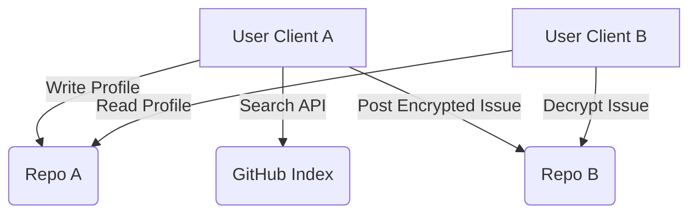

# Architecture Reference

**Status:** Draft 2.0

## 1. Topology

ForkFlirt operates on a **Serverless Peer-to-Peer (P2P)** topology using GitHub as a passive relay. Unlike traditional dating apps where a central server holds all user data, ForkFlirt distributes the database across thousands of user-owned repositories.

### 1.1 The "Host" (The User)

Every user acts as a host. By deploying the ForkFlirt Client (e.g., to GitHub Pages or Vercel), the user creates a static Single Page Application (SPA). This SPA contains:

1.  **The Viewer:** Logic to search the GitHub Index and render other profiles.
2.  **The Editor:** Logic to update their own `profile.json` and commit changes via the GitHub API.
3.  **The Wallet:** IndexedDB management of encrypted RSA-OAEP private keys with passphrase protection.
4.  **Security Layer:** CSRF protection, rate limiting, and behavioral analysis.
5.  **Cache Manager:** Local profile caching with TTL and size limits.

### 1.2 The Relay (GitHub)

We utilize GitHub purely for its public APIs and infrastructure. We treat GitHub as a "dumb pipe" and storage bucket.

- **Search API:** Used for discovery (querying `topic:forkflirt-profile`).
- **Raw Content API:** Used for efficient profile fetching without API quota consumption.
- **Git Blob API:** Used for fetching `profile.json` and images without cloning the full repo.
- **Issues API:** Used as a message queue for encrypted payloads.

## 2. Client Agnosticism

While Plug Puppy LLC maintains the _Reference Client_, the protocol is data-first. As long as a client adheres to the schema and security practices, it can interact with the network.

- **TUI Clients:** A terminal-based client could be built for pure CLI usage.
- **Mobile Apps:** Native React Native/Flutter apps can act as the view layer.
- **Aggregators:** Community hubs can index the JSON files to create specific niche directories (e.g., "Rust Developers in Berlin").

### Requirement: Encryption Compliance

All clients MUST adhere to the [Security Specification](./03-SECURITY.md). Clients that send unencrypted messages or expose private keys will be blacklisted by the community via shared blocklists.

## 3. Security Architecture

### 3.1 Authentication & Session Management

Clients must implement multi-layered security for user authentication:

#### 3.1.1 Token Validation
- **Format Validation**: Strict GitHub PAT format validation (ghp_ or github_pat_ prefixes)
- **Scope Verification**: Validate tokens have required scopes (public_repo, user:read)
- **Source Protection**: Block URL-based token injection, require manual input
- **Age Tracking**: Monitor token age with 90-day rotation recommendations

#### 3.1.2 CSRF Protection
- **Token Generation**: UUID-based CSRF tokens for each operation
- **Validation**: Server-side token validation for all sensitive operations
- **Cleanup**: Automatic token cleanup after successful operations

#### 3.1.3 Rate Limiting & Abuse Prevention
- **Login Attempts**: Maximum 3 attempts per 10-minute window
- **Progressive Lockout**: 30-minute lockout after repeated failures
- **CAPTCHA Integration**: Math challenges after 2 failed attempts
- **Session Cleanup**: Comprehensive data clearing on logout

### 3.2 Cryptographic Implementation

#### 3.2.1 Key Management
- **Algorithm**: RSA-OAEP for key exchange, AES-GCM for data encryption
- **Key Storage**: Encrypted private keys in IndexedDB with AES-GCM wrapping
- **Key Derivation**: PBKDF2 with 600,000 iterations and salt
- **Key Rotation**: Forward secrecy with rotation management

#### 3.2.2 Passphrase Security
- **Strength Validation**: zxcvbn integration with pattern detection
- **Complexity Requirements**: Minimum 4 words, 12 characters, 2 character types
- **Pattern Blocking**: Common patterns and sequential character detection
- **Encryption**: Passphrase-derived keys with salt/IV

## 4. Performance & Caching

### 4.1 Profile Caching System

Clients must implement efficient caching to reduce API usage:

#### 4.1.1 Cache Implementation
- **Storage**: IndexedDB with structured query support
- **TTL Support**: User-controlled cache duration with minimum 5-minute floor
- **Size Limits**: Maximum 500 profiles with LRU eviction
- **Expiration**: Automatic cleanup of expired entries

#### 4.1.2 Cache Strategy
- **Raw URL Fetching**: Use `raw.githubusercontent.com` to save API quota
- **Cache Hints**: Respect user caching preferences from profile settings
- **Validation**: Schema validation before caching to prevent corruption

### 4.2 API Optimization

- **Quota Management**: Intelligent use of authenticated vs anonymous requests
- **Batch Operations**: Minimize API calls through efficient data fetching
- **Error Handling**: Specific error responses for different failure modes

## 5. Data Flow Lifecycle

### 5.1 Setup

1.  User forks the client.
2.  User generates Keys in-browser with passphrase protection.
3.  User publishes `profile.json` to the `main` branch.
4.  GitHub indexes the repository (approx. 5-10 minute latency).

### 5.2 Discovery

1.  Client performs `GET /search/repositories?q=topic:forkflirt-profile`.
2.  Client receives list of candidate repos.
3.  Client checks profile cache for existing entries.
4.  For uncached profiles, fetch raw JSON from the **Profile Directory**:
    `https://raw.githubusercontent.com/{username}/{repo}/main/profile/profile.json`
5.  Client validates profiles against schema and caches valid entries.
6.  Client filters results locally including behavioral blocking rules.

### 5.3 Messaging

1.  Client A drafts a message.
2.  Client A encrypts payload using Client B's public key (found in `profile.json`).
3.  Client A posts a new Issue on Repo B with `forkflirt-handshake` label.
4.  Client B polls their own Issues for the "Handshake" label.

## 6. Behavioral Analysis & Safety

### 6.1 Behavioral Blocking System

Clients must implement behavioral analysis to detect and prevent abuse:

#### 6.1.1 Pattern Detection
- **Obfuscation Detection**: Character substitution, mixed case patterns, excessive whitespace
- **Repetition Analysis**: Content similarity detection with 80% threshold
- **Frequency Monitoring**: Track interaction rates (>10/minute flagged as high risk)
- **Keyword Obfuscation**: Fuzzy matching with leet speak detection

#### 6.1.2 Temporary Blocking
- **Block Types**: Spam, harassment, impersonation, blocklist bypass
- **Duration**: Configurable (default 7 days) with automatic expiration
- **Severity Levels**: Low, Medium, High with different response actions
- **Storage**: IndexedDB with cleanup of expired blocks

### 6.2 Enhanced Content Filtering

Clients must implement content filtering beyond basic `.forkflirtignore`:

- **Fuzzy Keyword Matching**: Handle character substitution (0→o, 1→i, 2→z, etc.)
- **Pattern Analysis**: Multiple suspicious patterns required for false positive reduction
- **Behavioral Scoring**: Risk assessment based on multiple factors
- **User Control**: Users can view and manage their behavioral block data

## 7. API Limits & Quotas

Since there is no backend proxy, the client hits the GitHub API directly from the user's IP.

- **Unauthenticated Requests:** 60 requests/hour (Limited functionality).
- **Authenticated Requests (OAuth):** 5,000 requests/hour (Full functionality).

### 7.1 Quota Management

- **Cache Optimization**: Raw URL fetching to minimize authenticated API usage
- **Rate Limiting**: Respect GitHub rate limits with proper error handling
- **Fallback Modes**: Graceful degradation when quotas are exceeded
- **Token Validation**: Verify token scopes and permissions before use

**Constraint:** The client MUST require the user to "Login with GitHub" to obtain a Personal Access Token (PAT) or OAuth token to function effectively.
