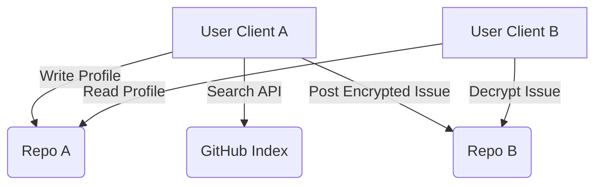

# Architecture Reference

**Status:** Draft 1.0

## 1. Topology

ForkFlirt operates on a **Serverless Peer-to-Peer (P2P)** topology using GitHub as a passive relay. Unlike traditional dating apps where a central server holds all user data, ForkFlirt distributes the database across thousands of user-owned repositories.

### 1.1 The "Host" (The User)

Every user acts as a host. By deploying the ForkFlirt Client (e.g., to GitHub Pages or Vercel), the user creates a static Single Page Application (SPA). This SPA contains:

1.  **The Viewer:** Logic to search the GitHub Index and render other profiles.
2.  **The Editor:** Logic to update their own `profile.json` and commit changes via the GitHub API.
3.  **The Wallet:** LocalStorage management of the RSA-OAEP private key (Identity).

### 1.2 The Relay (GitHub)

We utilize GitHub purely for its public APIs and infrastructure. We treat GitHub as a "dumb pipe" and storage bucket.

- **Search API:** Used for discovery (querying `topic:forkflirt-profile`).
- **Git Blob API:** Used for fetching `profile.json` and images without cloning the full repo.
- **Issues API:** Used as a message queue for encrypted payloads.

## 2. Client Agnosticism

While Plug Puppy LLC maintains the _Reference Client_, the protocol is data-first. As long as a client adheres to the schema and security practices, it can interact with the network.

- **TUI Clients:** A terminal-based client could be built for pure CLI usage.
- **Mobile Apps:** Native React Native/Flutter apps can act as the view layer.
- **Aggregators:** Community hubs can index the JSON files to create specific niche directories (e.g., "Rust Developers in Berlin").

### Requirement: Encryption Compliance

All clients MUST adhere to the [Security Specification](./03-SECURITY.md). Clients that send unencrypted messages or expose private keys will be blacklisted by the community via shared blocklists.

## 3. Data Flow Lifecycle

### 3.1 Setup

1.  User forks the client.
2.  User generates Keys in-browser.
3.  User publishes `profile.json` to the `main` branch.
4.  GitHub indexes the repository (approx. 5-10 minute latency).

### 3.2 Discovery

1.  Client performs `GET /search/repositories?q=topic:forkflirt-profile`.
2.  Client receives list of candidate repos.
3.  Client fetches the raw JSON from the **Profile Directory**:
    `https://raw.githubusercontent.com/{username}/{repo}/main/profile/profile.json`
4.  Client filters results locally.

### 3.3 Messaging

1.  Client A drafts a message.
2.  Client A encrypts payload using Client B's public key (found in `profile.json`).
3.  Client A posts a new Issue on Repo B.
4.  Client B polls their own Issues for the "Handshake" label.

## 4. API Limits & Quotas

Since there is no backend proxy, the client hits the GitHub API directly from the user's IP.

- **Unauthenticated Requests:** 60 requests/hour (Insufficient).
- **Authenticated Requests (OAuth):** 5,000 requests/hour (Sufficient).

**Constraint:** The client MUST require the user to "Login with GitHub" to obtain a Personal Access Token (PAT) or OAuth token to function effectively.
